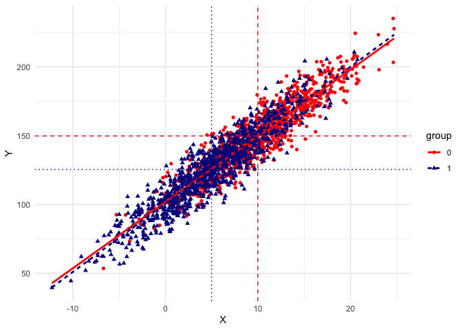

Tidy Output for Blinder-Oaxaca Decomposition
================

The `oaxacad` package is a simple package allowing to output results
from a Blinder-Oaxaca decomposition. This package is a wrapper of the
`oaxaca` package.

Install the package directly from **github** with

``` r
library(devtools)
# install_github("giacomovagni/oaxacad")
```

## Dependencies

To use `microecon` package please make sure you have installed the
`tidyverse` and `ggthemes` libraires.

``` r
library(oaxaca)
library(tidyverse)
library(broom)
library(gtools)
#
library(oaxacad)
```

# Simulate Data for Decomposition

The function `oaxaca_data` allows a simple way to simulate data for
testing the Oaxaca decomposition.

We have two groups (A and B, or 0 and 1), and an outcome $Y$.

Imagine that we want a simulated dataset with a *gap* that is only due
to **observed characteristics** (`X`).

The function allows to set one variable for observed characteristics.
The variable is normally distributed and the user can set the mean and
the sd.

In the function `oaxaca_data`, we can set the mean value of
characteristics for group A with `xA_avr = 10` and the mean value for
group B with `xB_avr = 5`.

The intercepts between the two groups are the same,
`interceptA_avr = 100`, `interceptB_avr = 100`, and the coefficients
(the regression’ $\beta$) are the same `betaA = 5`, `betaB = 5`.

``` r
output = oaxaca_data(interceptA_avr = 100, interceptB_avr = 100, betaA = 5, betaB = 5, xA_avr = 10, xB_avr = 5)
```

The function output a plot for the two groups

``` r
output$fig
```

    ## `geom_smooth()` using formula = 'y ~ x'

<!-- -->

The $X$ axis shows the difference in observed characteristics (`X`), and
on the $Y$ axis the gap in the outcome `Y`.
