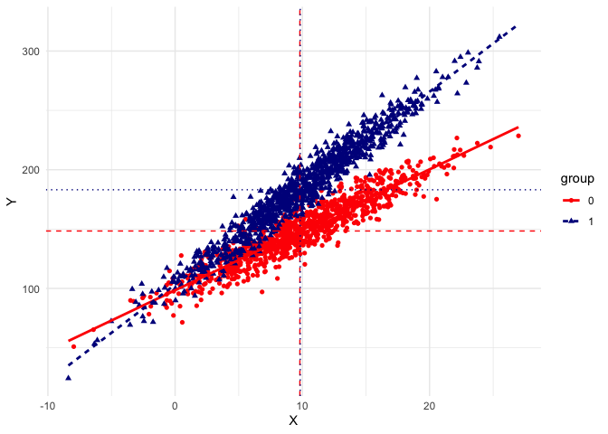

Tidy Output for Blinder-Oaxaca Decomposition
================

The `oaxacad` package is a simple package allowing to output results
from a Blinder-Oaxaca decomposition. This package is a wrapper of the
`oaxaca` package.

Install the package directly from **github** with

``` r
library(devtools)
# install_github("giacomovagni/oaxacad")
```

## Dependencies

To use `microecon` package please load the following libraries.

``` r
library(oaxaca)
library(tidyverse)
library(broom)
library(gtools)
#
library(oaxacad)
```

# Simulate Data for Decomposition

The function `oaxaca_data` allows a simple way to simulate data for
testing the Oaxaca decomposition.

We have two groups (A and B, or 0 and 1), and an outcome $Y$.

Imagine that we want a simulated dataset with a *gap* that is only due
to **observed characteristics** (`X`).

The function allows to set one variable for observed characteristics.
The variable is normally distributed and the user can set the mean and
the sd.

In the function `oaxaca_data`, we can set the mean value of
characteristics for group A with `xA_avr = 10` and the mean value for
group B with `xB_avr = 5`.

The intercepts between the two groups are the same,
`interceptA_avr = 100`, `interceptB_avr = 100`, and the coefficients
(the regression’ $\beta$) are the same `betaA = 5`, `betaB = 5`.

``` r
output = oaxaca_data(interceptA_avr = 100, interceptB_avr = 100, betaA = 5, betaB = 5, xA_avr = 10, xB_avr = 5)
```

The function output a plot for the two groups

``` r
output$fig
```

    ## `geom_smooth()` using formula = 'y ~ x'

<!-- -->

The $X$ axis shows the difference in observed characteristics (`X`), and
on the $Y$ axis the gap in the outcome `Y`.

The simulated data can be found in `output$dataframe`

------------------------------------------------------------------------

The function `oaxaca_sim()` takes the same inputs as the function
`oaxaca_data` but provides all the computations of the decomposition
internally, allowing easy simulations.

``` r
sim1 = oaxaca_sim(betaA = 5, betaB = 8, xA_avr = 10, xB_avr = 10)
sim2 = oaxaca_sim(betaA = 5, betaB = 5, xA_avr = 8, xB_avr = 10)

sim1$simulated_data$fig
```

<!-- -->

``` r
sim2$simulated_data$fig
```

<!-- -->

``` r
sim1$decomp_reg
```

    ## NULL

``` r
sim2$decomp_reg
```

    ## NULL

------------------------------------------------------------------------

## Using the Oaxaca function

We compute the decomposition using the following command

``` r
#
output = oaxaca_data(interceptA_avr = 100, interceptB_avr = 110, betaA = 10, betaB = 5, xA_avr = 10, xB_avr = 5)
# using the package oaxaca
output = oaxaca::oaxaca(Y ~ X | group, data=output$dataframe)
```

------------------------------------------------------------------------

We can tidy several outputs from the oaxaca function

``` r
Decomp_simple(output)
```

    ##                     gap   Explained Unexplained % explained
    ## coef(explained) 66.5642 25.7405 *** 40.8237 ***    38.67019

``` r
Decomp_Regression(output)
```

    ##              variable      β1 β1(SE) β1(pvalue)      β2 β2(SE) β2(pvalue)
    ## 1         (Intercept) 100.965  0.714          0 109.716  0.450          0
    ## 2                   X   9.899  0.062          0   5.050  0.063          0
    ## 3       decomposition      NA     NA         NA      NA     NA         NA
    ## 4 decomposition (\\%)      NA     NA         NA      NA     NA         NA
    ##       X1    X2 X1-X2 ΔXβ [endowment] ΔβX [coef]   ΔβΔX      Σ
    ## 1  1.000 1.000 0.000           0.000     -8.751  0.000 -8.751
    ## 2 10.222 5.125 5.097          25.740     24.854 24.720 75.315
    ## 3     NA    NA    NA          25.740     16.103 24.720 66.564
    ## 4     NA    NA    NA           0.387      0.242  0.371  1.000

``` r
Decomp(output)
```

    ## Omega = 1

    ## [[1]]
    ##             coef(endowments) se(endowments) coef(coefficients) se(coefficients)
    ## (Intercept)             0.00            0.0              -8.75             0.76
    ## X                      25.74            1.3              24.85             0.94
    ##             coef(interaction) se(interaction)
    ## (Intercept)              0.00            0.00
    ## X                       24.72            1.23
    ## 
    ## [[2]]
    ##                  endowment pval_endow coefficients pval_coef interaction
    ## coef(endowments)     25.74        ***       16.103       ***       24.72
    ##                  pval_int
    ## coef(endowments)      ***
    ## 
    ## [[3]]
    ##             Coeff_GroupRef Coeff_Group1   diff pvalue
    ## (Intercept)        100.965      109.716 -8.751      0
    ## X                    9.899        5.050  4.850      0
    ## 
    ## [[4]]
    ##             Composition_GroupRef Composition_Group1  diff pvalue
    ## (Intercept)                1.000              1.000 0.000    NaN
    ## X                         10.222              5.125 5.097      0
    ## 
    ## [[5]]
    ##               Decomposition
    ## Group1             135.5958
    ## GroupRef           202.1599
    ## TotalChange         66.5642
    ## .                          
    ## Compositional       25.7405
    ## Unexplained         16.1033
    ## Interaction         24.7204
    ## 
    ## [[6]]
    ##   perc_explained
    ## 1          38.67
